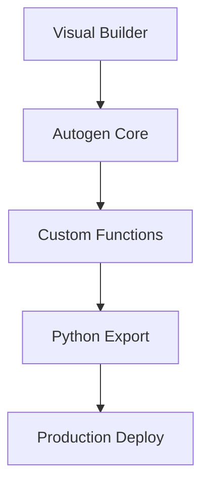

# Dotbase-ai
<div align="center">


*Building the future of agent-based development*

[](https://github.com/dotbase)
[](https://discord.gg/dotbase)
[](https://twitter.com/dotbase)

[Website](https://dotbase.ai) • [Docs](https://docs.dotbase.ai)
</div>

# Our Vision

<div align="center">

# 🎯 Transforming Agent Development

## *Building Tomorrow's AI Today*

</div>

<div align="center" style="font-size: 1.2em; padding: 2em 0;">

### We empower developers to create sophisticated AI workforces through intuitive visual development, transforming complex agent architectures into seamless workflows.

</div>

## 🚀 Mission Points

- **Democratize AI Development**: Making multi-agent systems accessible to all developers
- **Accelerate Innovation**: Reducing time-to-market for AI solutions
- **Enable Collaboration**: Fostering a community of agent developers
- **Drive Excellence**: Setting new standards in visual AI development

<div align="center">

---

### *"Simplifying complexity, amplifying possibilities"*

</div>

## 🎯 Flagship Product

<div align="center">

### Dotbase-app
*Visual Development Platform for Multi-Agent Systems*

</div>

Transform complex agent systems into intuitive workflows:

- 🎨 Design agent networks visually
- 🤖 Built on Microsoft's Autogen
- 🔄 Export to production Python code
- 🛠️ Integrate custom tools seamlessly
- 📊 Debug agent interactions in real-time

## 🚀 Core Technologies



### Stack Overview
```python
tech_stack = {
    "frontend": ["React", "TypeScript", "Tailwind"],
    "backend": ["FastAPI", "Autogen", "PostgreSQL"],
    "deployment": ["Docker", "Kubernetes", "AWS"]
}
```

## 🌟 Features Matrix

| Development | Deployment | Enterprise |
|:----------:|:----------:|:----------:|
| Visual Builder | One-Click Deploy | Team Management |
| Code Export | Version Control | Access Control |
| Custom Functions | Monitoring | Audit Logs |
| Debug Tools | Scaling | SSO Integration |

## 🛠️ Resources

<div align="center">

| Resource | Description |
|:--------:|-------------|
| [📚 Documentation](https://docs.dotbase.ai) | Complete guides and API reference |
| [💻 Examples](https://github.com/dotbase/examples) | Ready-to-use templates |

</div>

## 🌐 Connect

- Support: support@dotbase.ai
- Security: security@dotbase.ai

<div align="center">

---

*Transforming agent development through visual innovation*

</div>
