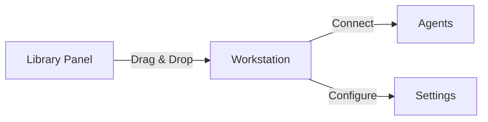

# Dotbase
<div align="center">


**Create agent-based workforces with drag-and-drop simplicity**

[Website](https://dotbase.ai) • [Documentation](https://docs.dotbase.ai) • [Examples](https://dotbase.ai/examples) • [Enterprise](https://dotbase.ai/enterprise)

</div>

---

## 🚀 Overview

Dotbase is a powerful low-code platform that transforms how you build AI agent workforces. With our intuitive drag-and-drop interface, create sophisticated agent networks and export them as production-ready Python code.

## ✨ Key Features

- 🎯 **Visual Agent Design**: Drag-and-drop interface for workforce creation
- 🔄 **Autogen Integration**: Built on Microsoft's Autogen framework
- 🐍 **Python Export**: Generate production-ready Python code
- 🛠️ **Custom Functions**: Add custom tools and capabilities
- 🤝 **Multi-Agent Support**: Create collaborative agent networks

## 🏗️ Architecture

### Agents

Our Autogen-based system supports four core components:

| Agent Type | Description |
|------------|-------------|
| `Nexus` | Configurable AI agents with custom system prompts |
| `Lumina` | NovaMind Assistant API integration with custom function support |
| `Bridge` | Human-agent interaction interface |
| `Synergy Hub` | Multi-agent collaboration hub |

### Tools

`Spark`
- Integrate Python functions
- Connect NovaMind Assistant functions
- Add custom capabilities

## 💻 Workstation

### Node Operations



- **Add**: Drag components from Library Panel
- **Connect**: Green handles indicate compatible connections
- **Delete**: Right-click for context menu

## 🚀 Deployment

### Local Setup

```bash
# Install dependencies
pip install pyautogen

# Run exported script
python your_workforce.py
```

### Replit Deployment

1. Create Python project
2. Add to `pyproject.toml`:
   ```toml
   [tool.poetry.dependencies]
   pyautogen = "0.2.7"
   ```
3. Run your exported script

## 🤝 Contributing

We welcome contributions! See our [Contributing Guide](CONTRIBUTING.md) for details.

## 📄 License

[MIT License](LICENSE)

## 🆘 Support

- Documentation: [docs.dotbase.ai](https://docs.dotbase.ai)
- Enterprise: enterprise@dotbase.ai
- Community: [Discord](https://discord.gg/dotbase)

---

<div align="center">
Made with ❤️ by Dotbase Team
</div>
